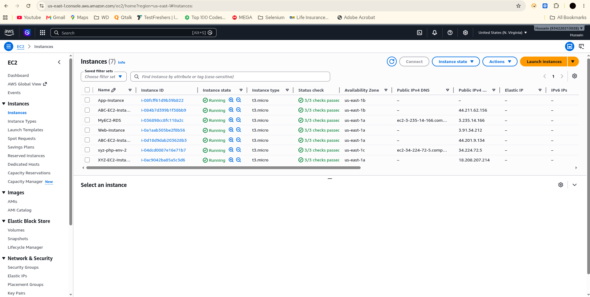
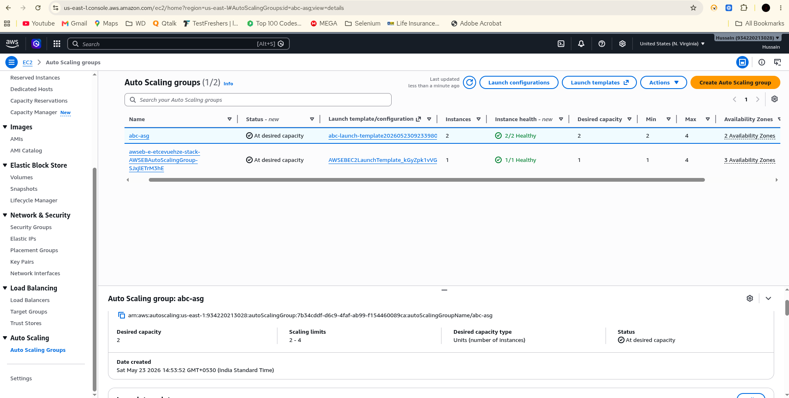
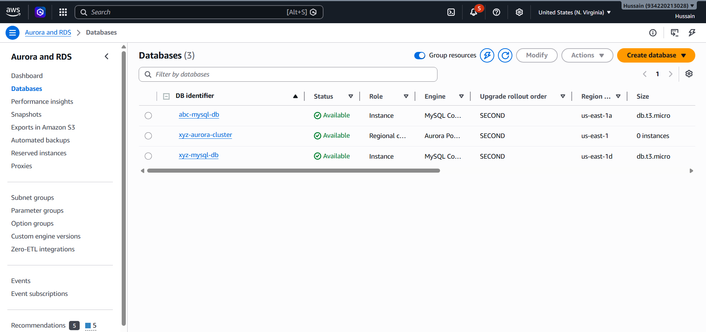
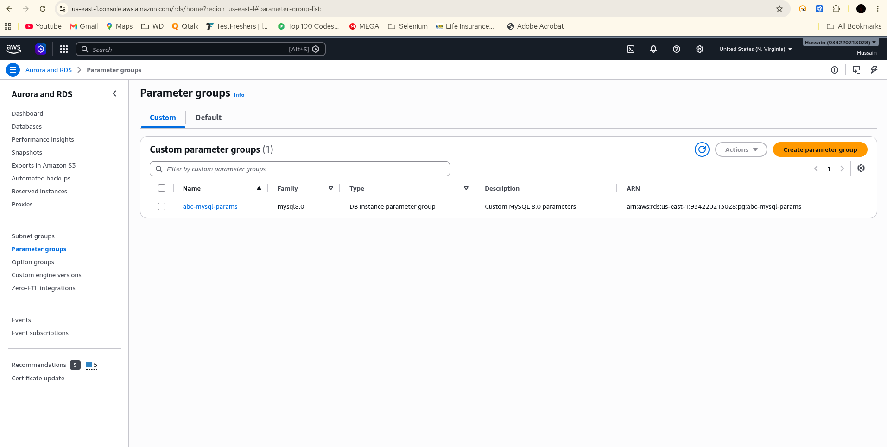
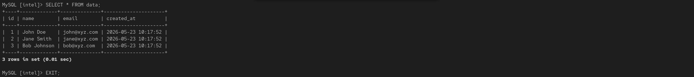
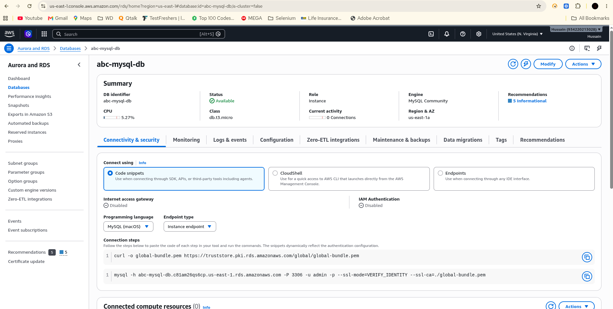
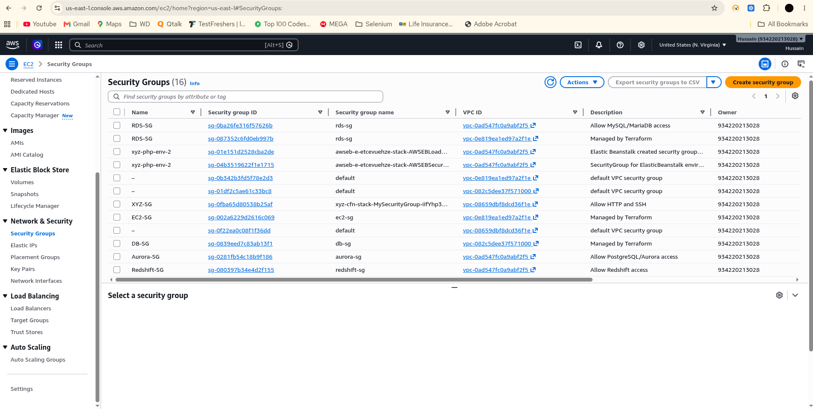
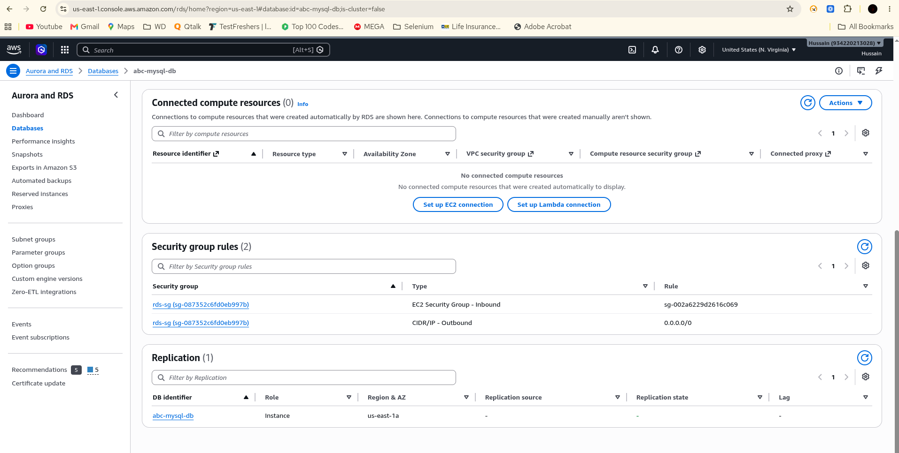
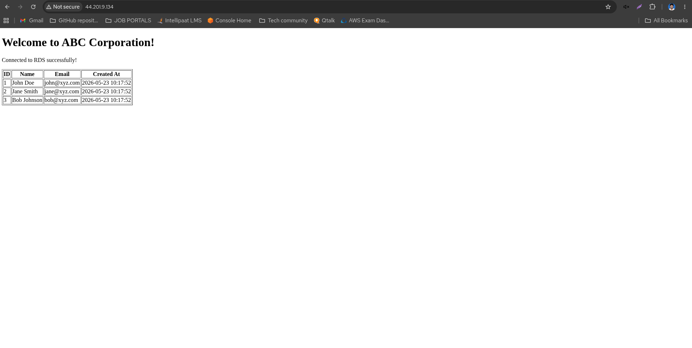

# Highly-Available-PHP-Application-Deployment-using-AWS-Auto-Scaling-RDS

## Problem Statement
Company ABC wants to migrate their product (PHP website + MySQL DB) to AWS
with high availability using Auto Scaling. The setup includes an EC2-hosted
PHP website connected to an Amazon RDS MySQL instance, with Auto Scaling
ensuring a minimum of 2 instances are always running.

---

## Architecture Overview

```
Internet Traffic
      ↓
Application Load Balancer
      ↓
Auto Scaling Group (Min: 2 EC2 Instances)
  ├── EC2 Instance 1 (PHP Website)
  └── EC2 Instance 2 (PHP Website)
      ↓
Amazon RDS (MySQL)
  Database: intel
  Table: data
```

---

## Tools & Technologies Used

- **Amazon EC2** – Virtual servers hosting the PHP website
- **Auto Scaling Group** – Maintains minimum 2 instances for high availability
- **Application Load Balancer** – Distributes traffic across EC2 instances
- **Amazon RDS (MySQL)** – Managed database for the application
- **Security Groups** – Controls traffic between EC2 and RDS
- **AWS Launch Template** – Defines EC2 configuration for Auto Scaling

---

## Step 1: Launch an EC2 Instance

### EC2 Configuration
| Setting | Value |
|---------|-------|
| AMI | Amazon Linux 2 |
| Instance Type | t2.micro |
| Key Pair | your-key-pair |
| Security Group | EC2-SG (allow all traffic) |
| Storage | 8 GB gp2 |

### EC2 User Data Script (Install PHP + Apache)

```bash
#!/bin/bash
yum update -y
yum install -y httpd php php-mysqlnd
systemctl start httpd
systemctl enable httpd

# Download website files
cd /var/www/html
wget https://your-website-files.zip
unzip your-website-files.zip
```

---

## Step 2: Enable Auto Scaling (Minimum 2 Instances)

### Create Launch Template

```bash
aws ec2 create-launch-template \
  --launch-template-name CompanyABC-Template \
  --version-description "PHP Website Template" \
  --launch-template-data '{
    "ImageId": "ami-0c55b159cbfafe1f0",
    "InstanceType": "t2.micro",
    "KeyName": "your-key-pair",
    "SecurityGroupIds": ["sg-xxxxxxxx"],
    "UserData": "<base64-encoded-user-data-script>"
  }'
```

### Create Auto Scaling Group

```bash
aws autoscaling create-auto-scaling-group \
  --auto-scaling-group-name CompanyABC-ASG \
  --launch-template LaunchTemplateName=CompanyABC-Template,Version='$Latest' \
  --min-size 2 \
  --max-size 5 \
  --desired-capacity 2 \
  --availability-zones us-east-1a us-east-1b \
  --target-group-arns arn:aws:elasticloadbalancing:us-east-1:<account-id>:targetgroup/CompanyABC-TG/xxxx
```

### Auto Scaling Policy

| Setting | Value |
|---------|-------|
| Minimum instances | 2 |
| Maximum instances | 5 |
| Desired capacity | 2 |
| Scale out trigger | CPU > 70% |
| Scale in trigger | CPU < 30% |

---

## Step 3: Create an RDS Instance

### RDS Configuration

| Setting | Value |
|---------|-------|
| Engine | MySQL 8.0 |
| Instance Class | db.t2.micro |
| Storage | 20 GB gp2 |
| DB Instance Identifier | companyabc-db |
| Master Username | admin |
| Master Password | intel123 |
| VPC | Default VPC |
| Security Group | RDS-SG |
| Multi-AZ | Enabled (High Availability) |
| Publicly Accessible | No |

### Create RDS via AWS CLI

```bash
aws rds create-db-instance \
  --db-instance-identifier companyabc-db \
  --db-instance-class db.t2.micro \
  --engine mysql \
  --master-username admin \
  --master-user-password intel123 \
  --allocated-storage 20 \
  --vpc-security-group-ids sg-yyyyyyyy \
  --backup-retention-period 7 \
  --multi-az \
  --no-publicly-accessible
```

---

## Step 4: Create Database & Table in RDS

### Database Details

| Setting | Value |
|---------|-------|
| Database Name | intel |
| Table Name | data |
| Password | intel123 |

### Connect to RDS and Create Database

```bash
# Connect to RDS from EC2 instance
mysql -h <rds-endpoint> -u admin -pintel123
```

### SQL Commands

```sql
-- Create the database
CREATE DATABASE intel;

-- Use the database
USE intel;

-- Create the table
CREATE TABLE data (
    id INT AUTO_INCREMENT PRIMARY KEY,
    name VARCHAR(100) NOT NULL,
    email VARCHAR(100) NOT NULL,
    message TEXT,
    created_at TIMESTAMP DEFAULT CURRENT_TIMESTAMP
);

-- Verify the table was created
DESCRIBE data;

-- Insert a test record
INSERT INTO data (name, email, message)
VALUES ('Test User', 'test@companyabc.com', 'Migration successful!');

-- Verify the record
SELECT * FROM data;
```

---

## Step 5: Change Hostname in Website

Update the PHP website's database configuration file to point to the
RDS endpoint instead of localhost.

### PHP Database Configuration (config.php)

```php
<?php
// Database configuration
define('DB_HOST', '<your-rds-endpoint>.rds.amazonaws.com');
define('DB_NAME', 'intel');
define('DB_USER', 'admin');
define('DB_PASS', 'intel123');

// Create connection
$conn = new mysqli(DB_HOST, DB_USER, DB_PASS, DB_NAME);

// Check connection
if ($conn->connect_error) {
    die("Connection failed: " . $conn->connect_error);
}

echo "Connected to RDS successfully!";
?>
```

### Where to Find RDS Endpoint

```
AWS Console → RDS → Databases → companyabc-db
→ Connectivity & Security → Endpoint
Example: companyabc-db.xxxxxx.us-east-1.rds.amazonaws.com
```

---

## Step 6: Allow Traffic from EC2 to RDS

Create security group rules so only EC2 instances can talk to the RDS instance.

### RDS Security Group (RDS-SG) – Inbound Rules

| Type | Protocol | Port | Source |
|------|----------|------|--------|
| MySQL/Aurora | TCP | 3306 | EC2-SG (Security Group ID) |

### EC2 Security Group (EC2-SG) – Outbound Rules

| Type | Protocol | Port | Destination |
|------|----------|------|-------------|
| MySQL/Aurora | TCP | 3306 | RDS-SG (Security Group ID) |

### Add Rule via AWS CLI

```bash
# Allow EC2 Security Group to access RDS on port 3306
aws ec2 authorize-security-group-ingress \
  --group-id sg-yyyyyyyy \
  --protocol tcp \
  --port 3306 \
  --source-group sg-xxxxxxxx
```

---

## Step 7: Allow All Traffic to EC2 Instance

### EC2 Security Group (EC2-SG) – Inbound Rules

| Type | Protocol | Port Range | Source |
|------|----------|------------|--------|
| All traffic | All | All | 0.0.0.0/0 |
| HTTP | TCP | 80 | 0.0.0.0/0 |
| HTTPS | TCP | 443 | 0.0.0.0/0 |
| SSH | TCP | 22 | 0.0.0.0/0 |

### Add All-Traffic Rule via AWS CLI

```bash
aws ec2 authorize-security-group-ingress \
  --group-id sg-xxxxxxxx \
  --protocol -1 \
  --cidr 0.0.0.0/0
```

---

## Security Group Summary

```
Internet
    ↓ (All traffic allowed)
EC2-SG (Attached to EC2 instances)
    ↓ (Port 3306 only, from EC2-SG)
RDS-SG (Attached to RDS instance)
    ↓
RDS MySQL (Database: intel, Table: data)
```

---

## Full Architecture Flow

```
User Request (Browser)
        ↓
Application Load Balancer
        ↓
Auto Scaling Group
  ┌─────────────────────────┐
  │  EC2 Instance 1         │
  │  PHP Website            │──────┐
  │  (AZ: us-east-1a)       │      │
  └─────────────────────────┘      ▼
  ┌─────────────────────────┐   RDS MySQL
  │  EC2 Instance 2         │   (intel DB)
  │  PHP Website            │──────┘
  │  (AZ: us-east-1b)       │
  └─────────────────────────┘
  (Scales up to 5 on high load)
```

---

## Screenshots

### EC2 Instance Running


### Auto Scaling Group Configuration


### Auto Scaling – Minimum 2 Instances


### RDS Instance Created


### RDS Endpoint


### Database & Table Created (intel / data)


### PHP Config – Hostname Updated to RDS Endpoint


### EC2 Security Group – All Traffic Allowed


### RDS Security Group – Port 3306 from EC2


### Website Running and Connected to RDS


---

## Key Learnings

- Launched EC2 instances with Apache and PHP installed via User Data script
- Configured Auto Scaling Group with minimum 2 instances across multiple AZs
- Created an Amazon RDS MySQL instance with high availability (Multi-AZ)
- Created database named `intel` with table named `data` and password `intel123`
- Updated PHP website hostname from localhost to RDS endpoint
- Configured security groups to allow EC2-to-RDS traffic only on port 3306
- Allowed all inbound traffic to EC2 instances for public web access
